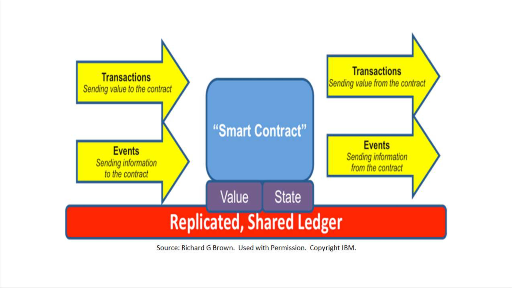
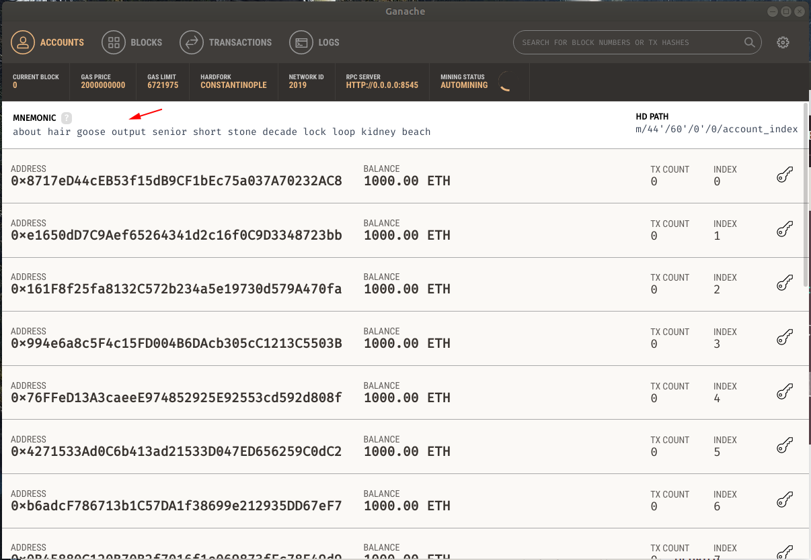
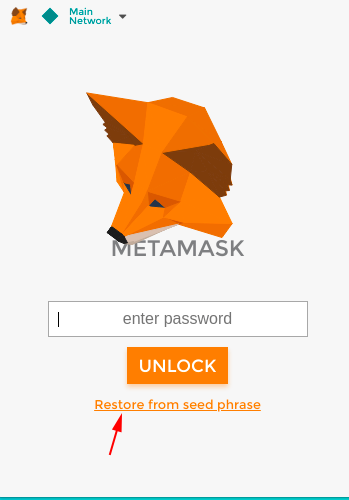
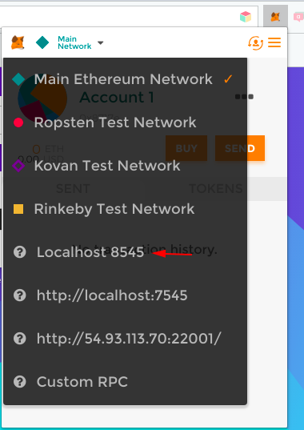
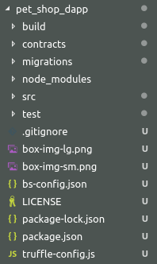

---

## Yarilabs on social media
* [twitter/yarilabs](https://twitter.com/yarilabs)
* [instagram.com/yarilabs](https://instagram.com/yarilabs)
* [medium/yarilabs](https://medium.com/yarilabs)

---

### Emanuel Mota - @emota7

Founder of Yari Labs

emanuel@yarilabs.com 


---
@snap[h2-yellow]
## Blockchain Workshop #1
@snapend

#### Smart Contracts Programming
---

## Why this workshop ?

---
## About the Talks 

### first talk

* Blockchain Definitions 
* Ethereum Overview
* Smart Contracts 
* ERC20 tokens
* Questions 

---
## About the Talks 

### second talk

* Solidity Programming Language
* Questions 
* Demos & Hands ON

---
### Intro / Get to know the audience !
---

## Blockchain Overview
+++

### Blockchain Overview
* A blockchain is a globally shared, transactional database. 
* everyone can read entries in the database 
* changes can only happen via transactions accepted by all others

+++

### Blockchain Overview
* transactions are always cryptographically signed
* bundled in blocks and chained together 
 

---

### Bitcoin
* Created 3 January 2009 by Satoshi Nakamoto
* Cryptocurrency (Bitcoin)
* Bitcoin Blockchain
* One shared distributed ledger 
* Support for a "Script"
* Limited programmability 

---

### Ethereum 
Many times called "The World Computer"!

+++

### Ethereum 

   <div class="left">
     Ethereum Network
     
  </div>

  <div class="right">
    <p>
      “Each node of the Ethereum network hosts a blockchain database and 
      a node client capable of executing application code stored on blockchain.
      Nodes communicate through <span class="highlight">Wire protocol</span> and expose same interface but 
      can be implemented in different languages.”
    </p>
    <br>
    <p class="lowernote">
      Excerpt From: Roberto Infante. “Building Ethereum ÐApps” 
    </p>
  </div>

+++

### Ethereum
* 2 ethers are created with each new block (mined every 15-17 seconds)
+++

### Ethereum
* Bitcoin like distributed ledger 
* Crypto currency (Ether)
* Ethereum Virtual Machine (EVM) 
* Turing complete
+++

### Ethereum
  * Ethereum Blockchain
  * Contracts (code) 
  * Storage
  * Logs
  * Events
+++

### Ethereum
  * Two kinds of accounts 
  * External Accounts (wallets controlled by humans)
  * Contract Accounts (controlled by code)
  * every account has a balance 
+++

### Ethereum
  * Code execution costs GAS 
  * Transaction is a message sent from one account to another and can have a data
  payload

---

### Smart Contracts

> "A smart contract is a computer program that directly controls digital assets
> and which is run in such an environment that it can be trusted to faithfully execute."
<div style="text-align: right"> (Vitalik Buterin) </div>

+++

### Smart Contracts 

Smart contract flow of data 

+++


+++

### Smart Contracts 
* Contract = code (i.e. functions) + data (i.e. state) and resides on the blockchain 
* EVM is the runtime for Smart Contracts on Ethereum
* Accounts have a persistent memory area which is called storage
* Contracts can neither read nor write to any storage apart from their own
+++

### Smart Contracts 
* Contracts can call other contracts 
* 1024 max call stack depth
* Support Events
* Contracts can purge themselves from the blockchain (OPCODE selfdestruct)

---

## What is an ERC20 token?

---?gist=emanuel/d98aa07ce3b21d08b45c108722e7f83d&&lang=Javascript&title=GIST: ERC20 Token 

@[2-11](Balances definition)
@[14-21](Transfer function)

<p class="lowernote"> (from ethereum.org)</p>
+++

### ERC20 token
<p class="lowernote">
  An ERC20 token implements the following API
</p>
<ul class="lowernote">
  <li> name </li> 
  <li> symbol</li>
  <li> decimals</li>
  <li> transfer(to, value)</li>
  <li> transferFrom(from, to, value)</li>
  <li> approve(spender, value)</li>
  <li> approveAndCall(spender, value, extraData)</li>
  <li> burn(value)</li>
  <li> burnFrom(from, value)</li>
  <li>  </li>
  <li> plus trigger a set of events </li>
</ul>
<p class="lowernote">
  a complete spec of a ERC20 Token check  https://ethereum.org/token
  and https://github.com/ethereum/EIPs/blob/master/EIPS/eip-20.md
</p>
<!-- There are thousands of ethereum based tokens.(https://etherscan.io/tokens) -->
+++

### ERC20 token

```javascript
  contract ERC20Interface {
     function totalSupply() public constant returns (uint);
     function balanceOf(address tokenOwner) 
              public constant returns (uint balance);
     function allowance(address tokenOwner, address spender) 
              public constant returns (uint remaining);
     function transfer(address to, uint tokens) 
              public returns (bool success);
     function approve(address spender, uint tokens)
              public returns (bool success);
     function transferFrom(address from, address to, uint tokens)
              public returns (bool success);
 
     event Transfer(address indexed from, address indexed to, uint tokens);
     event Approval(address indexed tokenOwner, address indexed spender, uint tokens);
 }
```

---

## Questions ?

---
### Emanuel Mota 
### http://yarilabs.com  
### @yarilabs

* emanuel@yarilabs.com 
* twitter: @emota7
* github: emanuel 

---
@snap[h2-yellow]
## Smart Contracts 
@snapend

#### Solidity Programming Language

---

## Helder Pinto 

Developer at Yari Labs

helder@yarilabs.com

---


## Ethereum high level languages
+++

## Ethereum high level languages

* **Solidity**: is a language **similar to JavaScript** which allows you to develop contracts and compile to EVM bytecode. It is currently the flagship language of Ethereum and the most popular.

* **Serpent**: Serpent is a language **similar to Python** which can be used to develop contracts and compile to EVM bytecode.

* **LLL**: Lisp Like Language (LLL) is a low level language similar to Assembly. It is meant to be very simple and minimalistic; essentially just a tiny wrapper over coding in EVM directly.

[source](https://solidity.readthedocs.io/)
---

## Solidity Programming Language
https://solidity.readthedocs.io/
+++

### Solidity 

Solidity is a statically typed, contract programming language that has similarities to 
Javascript, Java and C.

+++

### Solidity 

Has some contract-specific features like:
* modifier (guard) clauses
* event notifiers for listeners 
* custom global variables.
+++

### Solidity 
Hello World

```javascript
  pragma solidity ^0.4.19;

  contract HelloWorld {

  }

```
<p class="lowernote">
  <span class="highlight">version pragma</span> — declares the version of the compiler to be used 
  to avoid breaking changes introduced on future versions
</p>
+++

### Solidity 
Statically typed language 

```javascript
  contract Example {
    // This will be stored permanently in the blockchain
    uint myUnsignedInteger = 100;
    string name;
  }
```

* `uint data type` is an unsigned integer (non-negative number) 
* `int data type` is used for signed integers
* uint has 256 bits we can also have uint8, uint16, uint32 
+++

### Solidity 
Address

The address type comes in two flavours, which are largely identical:

- `address`: Holds a 20 byte value (size of an Ethereum address).
- `address payable`: Same as address, but with the additional members transfer and send.

+++

### Solidity 
Address


Type conversions:
>  Implicit conversions from address payable to address are allowed, whereas conversions from address to address payable are not possible (the only way to perform such a conversion is by using an intermediate conversion to uint160).

+++

### Solidity 
Members of Addresses
- `balance` and `transfer`

```javascript
  address payable x = address(0x8717eD44cEB53f15dB9CF1bEc75a037A70232AC8);
  address myAddress = address(this);
  if (x.balance < 10 && myAddress.balance >= 10) x.transfer(10);
```
[see more Members of Address Types](https://solidity.readthedocs.io/en/latest/units-and-global-variables.html#address-related)

+++

### Solidity 
Enum Types

`Enums can be used to create custom types with a finite set of ‘constant values’`
```javascript
  enum State { Created, Locked, Inactive } // Enum
```
+++

### Solidity 
Mappings and data type address 

```javascript 
  // For a financial app, storing a uint that holds the user's account balance:
  mapping (address => uint) public accountBalance;

  // Or could be used to store / lookup usernames based on userId
  mapping (uint => string) userIdToName;

  // mapping with mappings
  mapping(uint => mapping(bool => Data[])) public data;
```

<ul class="lowernote">
  <li> first example, the key is an address and the value is a uint</li> 
  <li> second example, the key is a uint and the value is a string</li>
</ul>
+++


### Solidity 
More complex data types - Structs 

```javascript
  struct TokenHolder {
    uint age;
    string obs;
  }

  // Arrays
  string[5] stringArray;
  // a dynamic Array - has no fixed size, can keep growing:
  uint[] dynamicArray;
  // Public array
  TokenHolder[] public shareHolders;
```
+++

### Solidity 

Function types are notated as follows

```javascript

function (<parameter types>) {internal|external} [pure|view|payable] [returns (<return types>)]

```

+++

### Solidity 
Function declarations 

```javascript

  uint[] scores;

  function addNewScore(string _clientId, uint _score) public {
     ... 
     _updateScores(_score);
  }

  function _updatesScores(string _clientId, uint _number) private {
    ...
    scores.push(_number) {
    ...
  }
```
+++

### Solidity 
Function types 

* **pure** - functions can be converted to **view** and **non-payable** functions
* **view** - functions can be converted to non-payable functions
* **payable** - functions can be converted to non-payable functions

+++


### Solidity 
Visibility and Getters 

* **external** - External functions are part of the contract interface, which means they can be called from other contracts and via transactions. An external function f cannot be called internally (i.e. f() does not work, but this.f() works). External functions are sometimes more efficient when they receive large arrays of data.
+++

### Solidity 
Visibility and Getters 

* **internal** - Those functions and state variables can only be accessed internally (i.e. from within the current contract or contracts deriving from it), without using this.
+++


### Solidity 
Visibility and Getters 

* **public** - Public functions are part of the contract interface and can be either called internally or via messages. For public state variables, an automatic getter function (see below) is generated.
+++

### Solidity 
Visibility and Getters 

* **private** - Private functions and state variables are only visible for the contract they are defined in and not in derived contracts.
+++

### Solidity 
Visibility and Getters 

* **internal** - Those functions and state variables can only be accessed internally (i.e. from within the current contract or contracts deriving from it), without using this.
+++

### Solidity 
Visibility and Getters 

* **private** - Private functions and state variables are only visible for the contract they are defined in and not in derived contracts.
+++


### Solidity 
Function Returns 

```javascript
  function sayHello() public view returns (string) {

  function _multiply(uint a, uint b) private pure returns (uint) {
    return a * b;
  }

  // Functions can return many arguments, and by specifying returned arguments
  // names we don't need to explicitly return
  function increment(uint x, uint y) public returns (uint x, uint y) {
      x += 1;
      y += 1;
  }
  // when a function returns multiple values we need to parallel assign 
  (x1, y1) = increment(1,2);

```
+++

### Solidity 
Functions Modifiers

``` javascript
  modifier onlyAfter(uint _time) { require (now >= _time); _; }
  modifier onlyOwner { require(msg.sender == owner) _; }

  // Append right after function declaration
  function changeOwner(newOwner) onlyAfter(someTime) onlyOwner() {
      owner = newOwner;
  }
```
+++

### Solidity 
Events 
<p class="lowernote">
  Events are a way for a contract to communicate that something happened 
  on the blockchain to a front-end client that is 'listening' for events 
</p>

```javascript
  // declare the event
  event IntegersAdded(uint x, uint y, uint result);

  function add(uint _x, uint _y) public returns(uint) {
      uint result = _x + _y;
      // fire an event to let the app know the function was called:
      IntegersAdded(_x, _y, result);
      return result;
  }
```

<p class="lowernote">
  A javascript implementation would look something like:
</p>

```javascript
  YourContract.IntegersAdded(function(error, result) { 
    // do something with result
  }
```
+++

### Solidity 

Events are convenience interfaces with the EVM logging facilities.

```javascript

pragma solidity >=0.4.21 <0.7.0;

contract SimpleAuction {
    event HighestBidIncreased(address bidder, uint amount); // Event

    function bid() public payable {
        // ...
        emit HighestBidIncreased(msg.sender, msg.value); // Triggering event
    }
}

```

+++

### Solidity 
Error Handling

- ** assert(bool condition) **: 
 throws if the condition is not met - to be used for **internal errors**.

+++

### Solidity 
Error Handling

- ** require(bool condition) **:
 throws if the condition is not met - to be used for **errors in inputs**.

+++

### Solidity 
Error Handling

- ** revert() ** : 
  abort execution and revert state changes

+++


### Solidity 
Important global variables 

```javascript
  this; // address of contract
  this.balance; // often used at end of contract life to transfer balance 
```

```javascript
  // ** msg - Current message received by the contract ** **
  msg.sender; // address of sender
  msg.value; // amount of eth sent to contract (in wei) function should be "payable"
  msg.data; // bytes, complete call data
  msg.gas; // remaining gas
```

```javascript
now; // current time (approximately) - uses Unix time
```
+++

## Important Design Notes / style guide - Class methods order

```javascript
pragma solidity >=0.4.0 <0.6.0;

contract A {
    constructor() public {
    }

    function() external {
    }
    // External functions
    // External functions that are view
    // External functions that are pure
    // Public functions
    // Internal functions
    // Private functions
}

```
+++


+++

## Important Design Notes / style guide - Functions signature order

The visibility **modifier** for a function should come before any custom modifiers.
```javascript

  contract Suicide {
    // ... modifier onlyowner ...
    function kill() public onlyowner {
      selfdestruct(owner);
    }
  }

```

---

## Interact with Smart Contracts
Basic design

- The Contract Application Binary Interface (ABI) is the standard way to interact with contracts in the Ethereum ecosystem, **both from outside the blockchain** and for **contract-to-contract** interaction. 

Data is encoded according to its type, as described in this specification. The encoding is not self describing and thus requires a schema in order to decode.

+++

## Interact with Smart Contracts

Example:

```javascript

pragma solidity >=0.4.16 <0.6.0;

contract Foo {
  function bar(bytes3[2] memory) public pure {}
  function baz(uint32 x, bool y) public pure returns (bool r) { r = x > 32 || y; }
  function sam(bytes memory, bool, uint[] memory) public pure {}
}

```
+++

## Interact with Smart Contracts

The Method ID. This is derived as the first 4 bytes of the "sha3 or Keccak256" Keccak hash of the ASCII form of the signature baz(uint32,bool)

```javascript
sha3("baz(uint32,bool)") // 0xcdcd77c0
```
[More in contract ABI Specification](https://solidity.readthedocs.io/en/v0.5.5/abi-spec.html#abi)

+++

## Interact with Smart Contracts
For example with Solc ABI output : 

```javascript
pragma solidity ^0.5.0;

contract Test {
  constructor() public { b = hex"12345678901234567890123456789012"; }
  event Event(uint indexed a, bytes32 b);
  event Event2(uint indexed a, bytes32 b);
  function foo(uint a) public { emit Event(a, b); }
  bytes32 b;
}

```

+++

## Interact with Smart Contracts
would result in the JSON:

```JSON
[{
"type":"event",
"inputs": [{"name":"a","type":"uint256","indexed":true},{"name":"b","type":"bytes32","indexed":false}],
"name":"Event"
}, {
"type":"event",
"inputs": [{"name":"a","type":"uint256","indexed":true},{"name":"b","type":"bytes32","indexed":false}],
"name":"Event2"
}, {
"type":"function",
"inputs": [{"name":"a","type":"uint256"}],
"name":"foo",
"outputs": []
}]

```
+++

## Interact with Smart Contracts
Web3 
+++

## Interact with Smart Contracts
Web3 

This is the Ethereum JavaScript API which connects to the Generic JSON RPC spec.
You need to run a local or remote Ethereum node to use this library.

[Web3.js](https://github.com/ethereum/web3.js)

+++

## Interact with Smart Contracts

Similar libraries in other languages
  - Python Web3.py
  - Haskell hs-web3
  - Java web3j
  - Scala web3j-scala
  - Purescript purescript-web3
  - PHP web3.php
+++

## Interact with Smart Contracts

Truffle is the most popular development framework for Ethereum:

- [Truffle framework](https://truffleframework.com)

+++

## Interact with Smart Contracts
Test net:

- [Ganache](https://github.com/trufflesuite/ganache/releases)
+++

## Interact with Smart Contracts

Browser wallet:

- [Metamask](https://metamask.io/)

---

## Some Usefull Links

+++

### Some Usefull Links
* Ethereum website https://www.ethereum.org/
* Online compiler https://remix.ethereum.org/
* Online tools https://rinkeby.etherscan.io 
* https://etherscan.io (block explorer, tx submit)
* EthFiddle https://ethfiddle.com/
+++

### Some Usefull Links
* https://etherchain.org/
* http://infura.io (so you don’t have to run your own node/s)
* Truffle  https://github.com/ConsenSys/truffle. 
* Embark https://github.com/iurimatias/embark-framework
* Open Zeppelin https://openzeppelin.org/
* https://metamask.io/

---

## Questions ?

### Helder Pinto 
### http://yarilabs.com  
### @yarilabs

* helder@yarilabs.com 
* twitter: @helderjnpinto
* github: helderjnpinto
---

## Coffee break


---
## WORKSHOP - DApp PetShop 
* Lets make DApps!!!
* Clone this repo: https://github.com/realyarilabs/blockchain-workshop-2
* Telegram - https://t.me/bragablockchain

+++

## WORKSHOP - DApp PetShop 
Install dev dependencies

- [Docs | Solidity Cheat Sheet](configure_env/Docs.md)
- [Install dependencies](configure_env/Install dependencies.md)
    - Node & NPM
    - Ganache app (Test net)Error Handling
    - Truffle
    - Metamask

+++


## WORKSHOP - DApp PetShop 
### Copy MNEMONIC



+++
## WORKSHOP - DApp PetShop 
### Import on Metamask



+++

## WORKSHOP - DApp PetShop 
### Select the blockchain network



+++


## WORKSHOP - DApp PetShop 
### cd pet shop dapp folder



+++

## WORKSHOP - DApp PetShop 
### Compile and Migrate

```bash
> truffle compile

> truffle migrate

```

+++


## WORKSHOP - DApp PetShop 
### Run dev server

Serves the front-end "./src" on
http://localhost:3000

```bash

npm run dev

```

+++

## WORKSHOP - DApp PetShop 
### Connect the Pet shop app to metamask


++++

## WORKSHOP - DApp PetShop 
### Lets create an contract

pet_shop_dapp
|
|-> contracts
    |
    |-> Adoption.sol  

++++


## WORKSHOP - DApp PetShop 
### Contract - Adoption.sol  

```javascript
  pragma solidity ^0.5.0;

  ...
```

++++


## WORKSHOP - DApp PetShop 
### Contract - Adoption.sol  

```javascript
  pragma solidity ^0.5.0;

  contract Adoption {

  }
```

++++
## WORKSHOP - DApp PetShop 
### Contract - Adoption.sol  

- Create array of `address` type `adopters` with `16` size and make it `public`

```javascript
  pragma solidity ^0.5.0;

  contract Adoption {
    <- here ->
  }
```

++++

## WORKSHOP - DApp PetShop 
### Contract - Adoption.sol  

```javascript
  pragma solidity ^0.5.0;

  contract Adoption {
    address[16] public adopters;
  }
```

++++

## WORKSHOP - DApp PetShop 
### Contract - Adoption.sol 

Create an function for adopting a pet!
 - name: `adopt`
 - parameters: `petId` "must be unsigned integer" 
 - return: unsigned integer pedId
 
> This method **must revert the state of contract in case of pedId are not valid!**

```javascript
  pragma solidity ^0.5.0;

  contract Adoption {
    address[16] public adopters;
    
    // Adopting a pet
    <- function here ->

  }

```
++++


## WORKSHOP - DApp PetShop 
### Contract - Adoption.sol  

```javascript
  ...
   // Adopting a pet
    function adopt(uint petId) public returns (uint) {
        require(petId >= 0 && petId <= 15);

        adopters[petId] = msg.sender;
        return petId;
    }
  ...
```

++++

## WORKSHOP - DApp PetShop 
### Contract - Adoption.sol  

At the end we need an method for `getAdopters`:
- return: array of adopters

```javascript
  ...
    function adopt(uint petId) public returns (uint) { ... }

    // Retrieving the adopters
    <- function here ->
  ...
```

++++


## WORKSHOP - DApp PetShop 
### Contract - Adoption.sol  

At the end we need an method for `getAdopters`:

return: array of adopters

```javascript
  ...
    function adopt(uint petId) public returns (uint) { ... }

    // Retrieving the adopters
    function getAdopters() public view returns (address[16] memory) {
        return adopters;
    }
  ...
```
++++


## WORKSHOP - DApp PetShop 
### Compile the contract 


```shell 
truffle compile
```


++++


## WORKSHOP - DApp PetShop 
### Jump to migrations

- Copy the existing file of migrations

var Adoption = artifacts.require("Adoption");

```javascript

  module.exports = function(deployer) {
    deployer.deploy(Adoption);
  };

``` 

++++

## WORKSHOP - DApp PetShop 
### Run migrations

```shell
truffle migrate
``` 

++++

## WORKSHOP - DApp PetShop 
### Jump to `src` folder

This is or frontend of Adopters smart contract.

- app.js

++++


